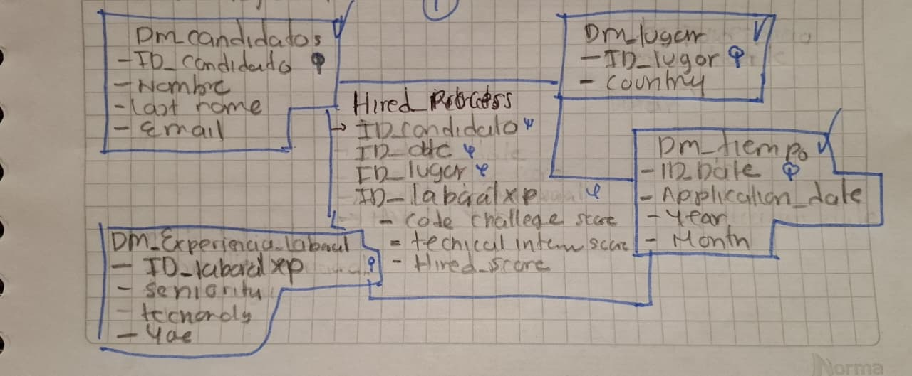
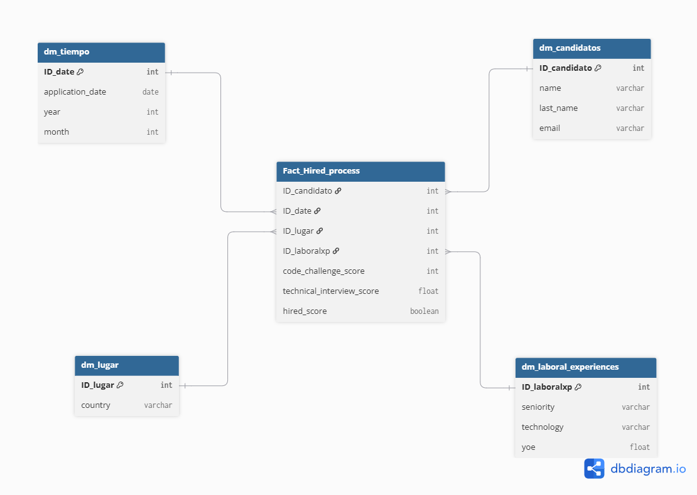
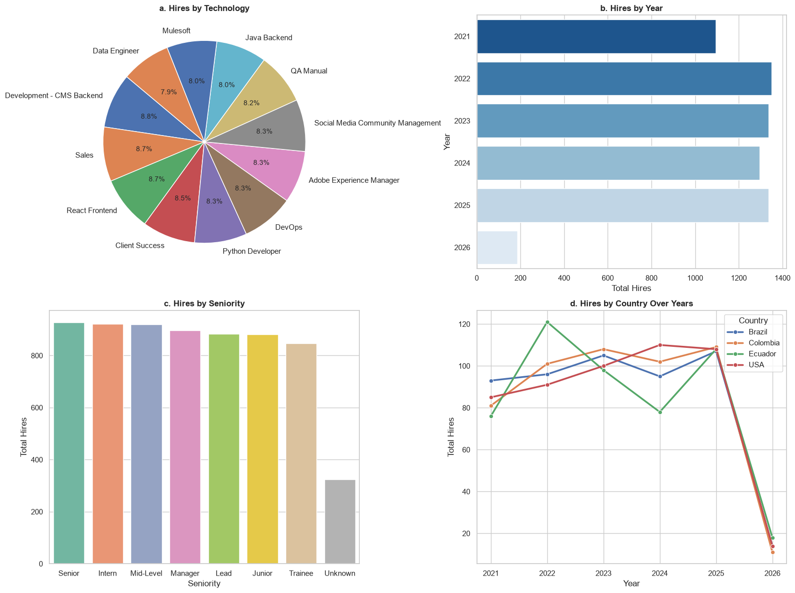

# DESAROLLO WORKSHOP 01 ETL 2026

Este proyecto es un pipeline ETL completo que procesa y analiza un dataset de 50,000 registros de un proceso de reclutamiento, transformando datos crudos para armar un Data Warehouse con Esquema Estrella en SQLite y responder preguntas de negocio mediante visualizaciones.

 Antes de construir el modelo fue necesario limpiar varios problemas en la data: los años de experiencia (Yoe) tenían nulos y valores
 negativos por errores de tipeo, así que los nulos se rellenaron con 0 y se aplicó .abs() para corregir los negativos; en Technical Interview los nulos se asumieron como 0, se supone que no presentaron la entrevista; en Seniority los vacíos se denominaron como
 'Unknown' para no perder el registro; y los correos mal escritos o vacíos se detectaron con Regex y se estandarizaron como
 'nocorreo@correo.com'.

Además, se creó la regla de negocio Hired_Score, la variable que define si un candidato fue contratado o no, se marca como 1 si obtuvo 7 o más tanto en el Code Challenge como en la Entrevista Técnica; si no cumple ambas condiciones, queda en 0.

# DIAGRAMA DE ESTRELLA





Para el esquema/diagrama de estrella, estructuré las dimensiones y la fact table de la siguiente manera: 

La tabla de hechos, Fact_Hired_process centré las métricas númericas y las PKs / IDs de las dimensiones y el resultado final del proceso o análisis de contratación, si es contratable o no. 

Las dimensiones o las puntas del esquema son:

 dm_tiempo con ID_date, Application date que la dan el CSV original, year y month. 

dm_lugar con ID_lugar la PK y con country.

Tiempo y lugar se manejaron separados porque son dos dimensiones diferentes el cúando/tiempo y el dónde/lugar. Es buena práctica, la correcta cuando se tienen variables de este tipo. 

Luego tenemos la dimensión dm_laboral_experiences donde se agruparon los atributos del perfil profesional de los candidatos como seniority, technology, yoe y se agregó la PK ID_laboralxp.

Por último, la dimensión dm_candidato, donde se aisla la información que identifica al postulante, nombre, apellido, correo y la PK de ID_candidato. Tambíen es buena práctica manejar de esta manera la información, por seguridad y limpieza de datos y no saturar la tabla de hechos. 

El esquema se manejó de esa manera para darle prioridad o enfocar los datos a los resultados y consignas que deseamos generar más adelante. 

# Visualizaciones 



# Instrucciones SetUp

Para correr este proyecto en tu máquina local, solo sigue estos pasos:

### 1. Requisitos previos
Tener instalado Python 3.x y Jupyter Notebook (o la extensión de Jupyter en VS Code).

### 2. Instalación de librerías
Asegúrate de instalar las dependencias ejecutando esto en tu terminal o dentro del notebook:

```bash
pip install pandas matplotlib seaborn